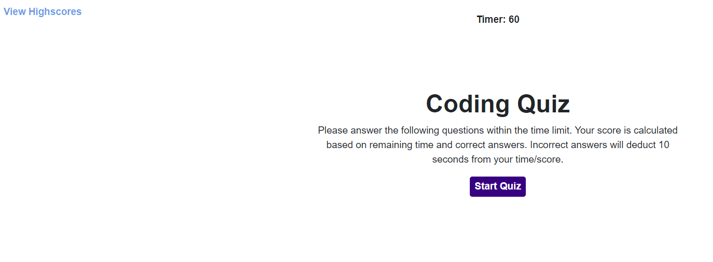
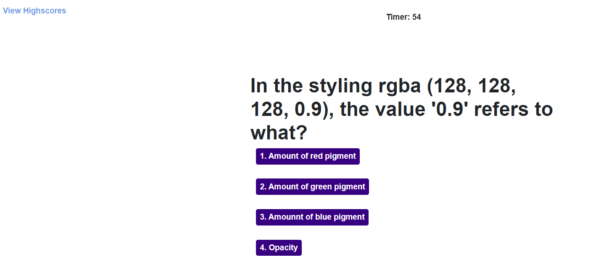
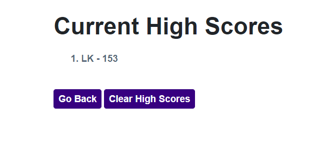

# Code Quiz Challenge
Code Quiz Challenge

Description

Per acceptance criteria and mockup, the requested functionality has been coded to create a timed quiz on coding topics. There are 5 multiple choice questions. Incorrect responses decrease the amount of time remaining in the quiz. Correct responses increase score. High scores are stored and can be cleared, as desired. Additional questions can be added if desired and timing can also be adjusted. 

Screenshots

 
 
 

Links
<ul>
    <li>
    Deployed application: https://lkalicki.github.io/code-quiz/
    </li>
    <li>
    GitHub Repository: https://github.com/lkalicki/code-quiz
    </li>
</ul>